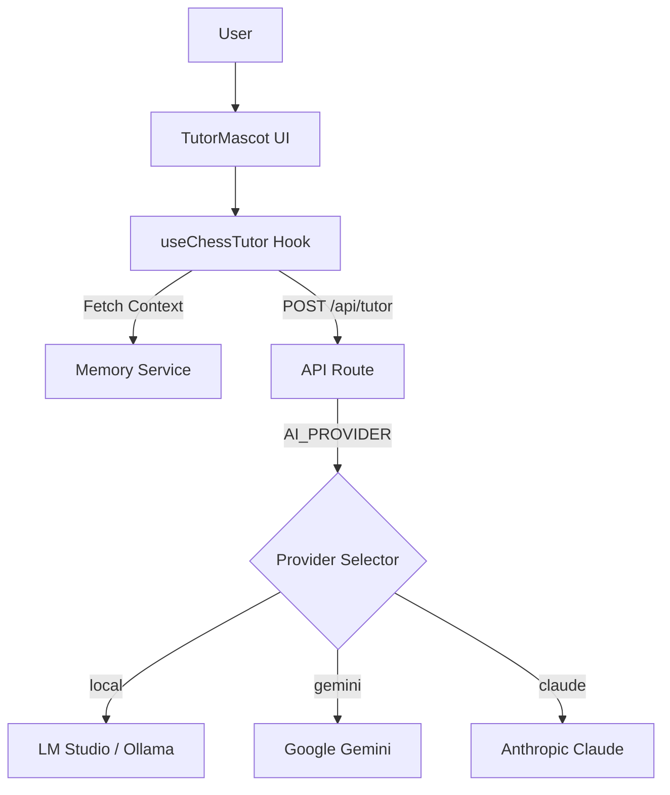

# AI Agents: Grandmaster Gloop 🧙‍♂️

This project features a specialized AI tutor agent named **Grandmaster Gloop**. This document outlines the agent's persona, technical architecture, and configuration.

## 🎭 Agent Persona

**Name:** Grandmaster Gloop
**Role:** Friendly Chess Tutor for Kids (approx. 7 years old)
**Personality:** Encouraging, magical, slightly goofy, and very supportive.
**Visuals:** A purple blob wearing a wizard hat.

### Core Directives
1.  **Be Encouraging:** Always start or end with positive reinforcement.
2.  **Keep it Simple:** Explain chess concepts using simple analogies (e.g., "The Rook is like a castle on a mission").
3.  **No Jargon:** Avoid complex algebraic notation unless necessary, or explain it simply.
4.  **Context Aware:** Remember previous interactions and the student's learning progress via the Memory System.

---

## 🏗 Technical Architecture

The AI system is built using the **Vercel AI SDK** to ensure provider agnosticism.

### Components

1.  **Frontend (`useChessTutor.ts` & `TutorMascot.tsx`)**
    *   Handles chat state and user interface.
    *   Maintains conversation history (short-term memory).
    *   Retrieves student context from the Memory Service (long-term memory).

2.  **Backend API (`api/tutor.ts`)**
    *   Serverless function (Vercel/Node.js).
    *   Handles incoming chat requests.
    *   Routes requests to the configured AI provider.
    *   Enforces the system prompt and response schema.

3.  **Provider Layer**
    *   Abstracted via Vercel AI SDK.
    *   Supports swapping models without code changes.

### Architecture Diagram

---

## 🔌 Supported Providers & Configuration

The agent can be powered by different LLMs by setting the `AI_PROVIDER` environment variable in `.env`.

### 1. Local LLM (Recommended for Dev)
Uses **LM Studio** or **Ollama** running locally. Free and works offline.

*   **Env:** `AI_PROVIDER=local`
*   **Setup:**
    1.  Install [LM Studio](https://lmstudio.ai/).
    2.  Load a model (e.g., `qwen3-30b`, `llama-3`).
    3.  Start the Local Server (default port 1234).
*   **Code:** Connects to `http://localhost:1234/v1`.

### 2. Google Gemini
Uses Google's `gemini-2.0-flash`. Fast and smart.

*   **Env:** `AI_PROVIDER=gemini`
*   **Key:** `GEMINI_API_KEY=AIza...`

### 3. Anthropic Claude
Uses `claude-3-5-sonnet`. High quality reasoning.

*   **Env:** `AI_PROVIDER=claude`
*   **Key:** `ANTHROPIC_API_KEY=sk-ant...`

---

## 🧠 Memory System

Gloop doesn't just look at the current board; he remembers the student.

*   **Session Context:** Tracks moves and mistakes in the current game.
*   **Long-term Memory:** `MemoryService` stores:
    *   Student name and age.
    *   Struggles (e.g., "Often forgets to castle").
    *   Milestones (e.g., "Completed Lesson 3").
    *   Personality traits for personalized encouragement.

This context is injected into the system prompt for every interaction.
